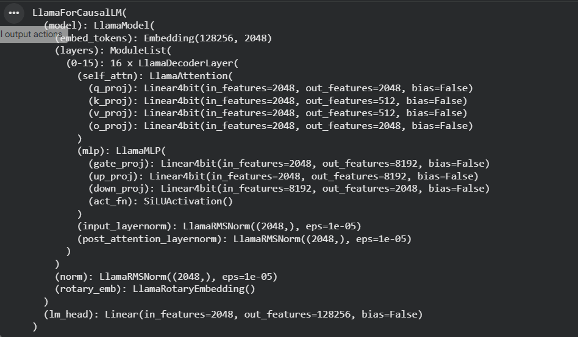
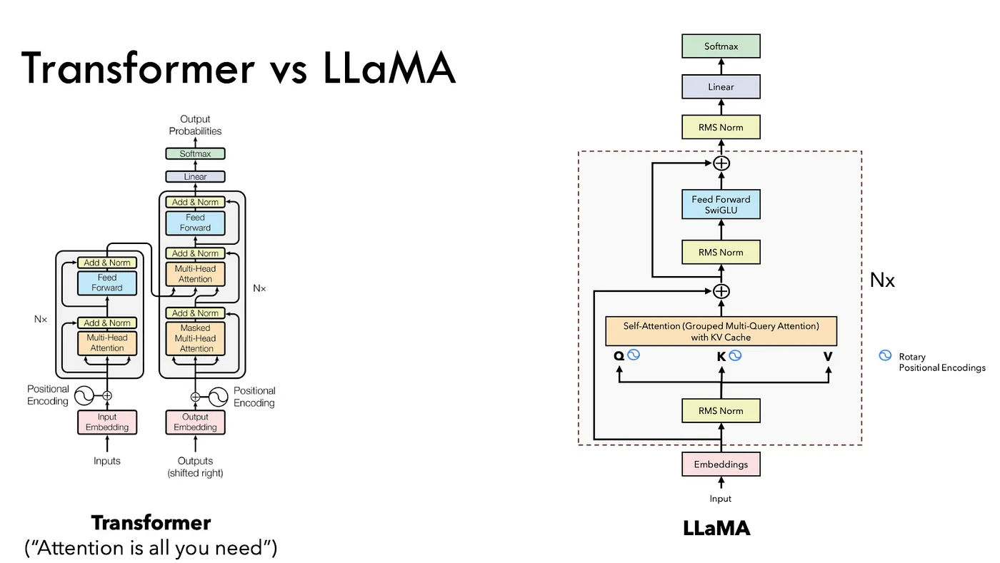

## Llama-3.2-1B-Instruct Architecture - Embeddings






The Llama 3.2 collection of multilingual large language models (LLMs) is a collection of pretrained and instruction-tuned generative models in 1B and 3B sizes (text in/text out). The Llama 3.2 instruction-tuned text only models are optimized for multilingual dialogue use cases, including agentic retrieval and summarization tasks. They outperform many of the available open source and closed chat models on common industry benchmarks.

Llama 3.2 is an auto-regressive language model that uses an optimized transformer architecture. The tuned versions use supervised fine-tuning (SFT) and reinforcement learning with human feedback (RLHF) to align with human preferences for helpfulness and safety.

### What is an auto regressive model?

#### What is an Auto-Regressive Model?

An **auto-regressive (AR) model** predicts the next element in a sequence using the elements that came before it.

In simple terms:

> It generates output **one step at a time**, and each new prediction depends on previous predictions.

---

#### Text Example

Input:

```
"I love to drink"
```

Model predicts next token:

```
"I love to drink" → "coffee"
```

Now the input becomes:

```
"I love to drink coffee"
```

Next prediction:

```
"I love to drink coffee in"
```

This continues until a stop condition is met.

The model **feeds its own outputs back as inputs**.

---

#### Mathematical View (Intuition Only)

Instead of predicting a full sentence at once, the model breaks it into conditional steps:

[
P(w_1, w_2, w_3, ..., w_n) = P(w_1)\cdot P(w_2|w_1)\cdot P(w_3|w_1,w_2)\cdots P(w_n|w_1...w_{n-1})
]

Each word depends on all the previous words.

---

#### Why LLMs Like LLaMA and GPT Are Auto-Regressive

They are trained to answer:

> “Given everything so far, what is the next token?”

They read text **left to right** and cannot see future tokens. That’s why they’re called **causal language models**.

---

#### How Generation Works Step-by-Step

1. Input tokens go into the model
2. Model outputs probability scores for all vocabulary tokens
3. One token is selected (greedy or sampling)
4. That token is appended to the input
5. Repeat

This loop is why text generation is sequential and slower than training.

---

#### Important Consequence

Because each prediction depends on previous outputs:

* Early mistakes can influence later text
* Errors can compound over long generations

---

#### Where the Idea Originally Came From

Auto-regression existed long before LLMs:

Time series example:

```
Value_today = f(Value_yesterday, Value_day_before)
```

Language models apply the same principle to words instead of numbers.

---

### Architecture in Depth

This the [colab notebook](https://colab.research.google.com/drive/1hhR9Z-yiqjUe7pJjVQw4c74z_V3VchLy?usp=sharing#scrollTo=UtN7OKILQato) from where I got the arch model layout.

```bash
LlamaForCausalLM(
  (model): LlamaModel(
    (embed_tokens): Embedding(128256, 2048)
    (layers): ModuleList(
      (0-15): 16 x LlamaDecoderLayer(
        (self_attn): LlamaAttention(
          (q_proj): Linear4bit(in_features=2048, out_features=2048, bias=False)
          (k_proj): Linear4bit(in_features=2048, out_features=512, bias=False)
          (v_proj): Linear4bit(in_features=2048, out_features=512, bias=False)
          (o_proj): Linear4bit(in_features=2048, out_features=2048, bias=False)
        )
        (mlp): LlamaMLP(
          (gate_proj): Linear4bit(in_features=2048, out_features=8192, bias=False)
          (up_proj): Linear4bit(in_features=2048, out_features=8192, bias=False)
          (down_proj): Linear4bit(in_features=8192, out_features=2048, bias=False)
          (act_fn): SiLUActivation()
        )
        (input_layernorm): LlamaRMSNorm((2048,), eps=1e-05)
        (post_attention_layernorm): LlamaRMSNorm((2048,), eps=1e-05)
      )
    )
    (norm): LlamaRMSNorm((2048,), eps=1e-05)
    (rotary_emb): LlamaRotaryEmbedding()
  )
  (lm_head): Linear(in_features=2048, out_features=128256, bias=False)
)
```

#### 1. Embedding

```bash
LlamaForCausalLM(
  (model): LlamaModel(
    (embed_tokens): Embedding(128256, 2048)
```

Perfect — let’s zoom into just this part and make it concrete.

```
LlamaForCausalLM
 └── LlamaModel
      ├── embed_tokens: Embedding(128256, 2048)
      └── rotary_emb: LlamaRotaryEmbedding()
```

We’ll follow a **real sentence** through these two components.

---

# Part 1 — `Embedding(128256, 2048)`

## What this layer is

This is a **lookup table** that converts tokens (word pieces) into vectors.

| Number     | Meaning                                           |
| ---------- | ------------------------------------------------- |
| **128256** | Vocabulary size (how many tokens the model knows) |
| **2048**   | Size of vector used to represent each token       |

So each token becomes a **2048-dimensional numeric representation**.

---

## Step-by-step example

Input sentence:

```
"The cat sat"
```

### Step 1 — Tokenization

The tokenizer converts text into IDs:

```
"The"  →  345
"cat"  →  8921
"sat"  →  12044
```

So model input is:

```
[345, 8921, 12044]
```

These numbers are **not meanings**, just indices.

---

### Step 2 — Embedding lookup

The embedding matrix has shape:

```
[128256 rows × 2048 columns]
```

Each row = vector representation of one token.

The model does:

```
vector_1 = embedding[345]
vector_2 = embedding[8921]
vector_3 = embedding[12044]
```

So now:

```
"The"  → [0.21, -0.77, 0.04, ... 2048 values]
"cat"  → [-0.55, 0.33, 1.12, ...]
"sat"  → [0.90, -0.12, 0.66, ...]
```

Now the sentence is no longer text — it’s:

```
[
  v_The,
  v_cat,
  v_sat
]
```

Each vector captures semantic properties learned during training.
For example, vectors for **cat**, **dog**, **tiger** will be numerically closer to each other than to **car**.

This is the **starting representation** before any understanding of sentence context.

---

# Problem: Embeddings Alone Don’t Know Word Order

At this stage, the model sees:

```
["The", "cat", "sat"]
```

but mathematically this is just a set of vectors. Without extra info:

```
"The cat sat" = "sat cat The"
```

To fix this, we add **positional information**.

That’s where **rotary embeddings** come in.

---

# Part 2 — `LlamaRotaryEmbedding()`

This encodes **where each word appears in the sentence**.

Transformers do not have built-in sequence awareness like RNNs, so we must inject position.

---

## What Rotary Embeddings Do

Instead of **adding** position info (older models did that), LLaMA uses **RoPE (Rotary Positional Embeddings)**.

It works by **rotating the vector representation based on its position**.

Think of each embedding vector as a point in a very high-dimensional space.

RoPE slightly rotates that point depending on whether the token is at:

* position 0
* position 1
* position 2
* etc.

---

## Apply to our sentence

We had:

```
Position 0 → "The"  → v_The
Position 1 → "cat"  → v_cat
Position 2 → "sat"  → v_sat
```

RoPE modifies them:

```
v_The  → rotate(v_The, position=0)
v_cat  → rotate(v_cat, position=1)
v_sat  → rotate(v_sat, position=2)
```

Now:

* "cat" at position 1 ≠ "cat" at position 5
* Word meaning stays, but position is encoded geometrically

---

## Why this is powerful

Rotary embeddings allow the model to naturally learn **relative positions**, like:

* which word comes before another
* how far apart two words are

So it can understand:

```
"The cat chased the dog"
```

and know:

* "cat" is subject
* "dog" is object
* relationships depend on distance and order

---

## Intuition

Embedding gives:

> What this word means

Rotary embedding gives:

> Where this word is located in the sequence

Together they produce:

> Meaning + position = usable input for attention layers

---

# Combined Output After These Two Steps

Before transformer layers even start, the sentence:

```
"The cat sat"
```

becomes a matrix:

```
3 tokens × 2048 features
(with meaning + position encoded)
```

This matrix is what enters the first attention layer.

---

# One-Line Summary

* `Embedding(128256, 2048)` converts each token into a 2048-dimensional meaning vector.
* `LlamaRotaryEmbedding()` modifies those vectors so the model knows each word’s position and relative order in the sentence.

## "The"  → [0.21, -0.77, 0.04, ... 2048 values]  does this represent the relation of The with all 128256 other tokens in vocab?

Great question — this is exactly where many people form the wrong mental model.

**Short answer: No.**
That 2048-dimensional vector for **"The"** does **not** directly store its relationship with all 128,256 tokens.

Let’s fix the intuition.

---

## What that vector actually is

```
"The" → [0.21, -0.77, 0.04, … 2048 numbers]
```

This is a **learned feature representation**, not a relationship table.

Think of it like this:

> Each dimension is a latent feature the model invented during training.

But we don’t know what each dimension means explicitly.

---

## Wrong mental model (common)

People think:

> “Dimension 1 = relation to 'cat'”
> “Dimension 2 = relation to 'dog'”
> …

That would require **128k dimensions**, which we do NOT have.

So that’s not what’s happening.

---

## Correct mental model

The vector represents the word in a **semantic feature space**, not word-to-word links.

Example of what some dimensions *might* capture (conceptually, not literally):

| Dimension | Could represent something like  |
| --------- | ------------------------------- |
| 12        | Is this a function word vs noun |
| 244       | Frequency in language           |
| 891       | Appears before nouns            |
| 1300      | Grammatical role indicator      |
| 1777      | Formal vs informal usage        |

These are abstract features learned automatically.

So **"The"** gets a vector that encodes:

* It’s an article
* Often appears before nouns
* Very frequent
* Grammatically structured word

---

## Then how does it learn relationships to other words?

Through **attention layers**, not embeddings.

### Important distinction:

| Component | Role                                                    |
| --------- | ------------------------------------------------------- |
| Embedding | What this word is like in general                       |
| Attention | How this word relates to other words *in this sentence* |

Relationships are **computed dynamically**, not stored.

---

## Example in context

Sentence:

```
"The cat slept"
```

Embeddings alone:

```
v_The   = article-type vector
v_cat   = animal-type vector
v_slept = verb-type vector
```

But understanding that:

> “The” refers to “cat”

happens in **attention**, where:

* "The" looks at "cat"
* "cat" looks at "slept"
* Dependencies form

That interaction is computed fresh every time.

---

## A better analogy (data engineering)

Embedding vector is like:

> A row in a feature store describing a word.

Not:

> A precomputed join with every other word.

The "joins" (relationships) happen later via attention.

---

## So what does embedding space really encode?

Words with similar usage end up near each other.

Example:

```
king – man + woman ≈ queen
```

This works because embeddings capture **patterns of usage**, not direct pairwise relations.

---

## Final takeaway

The 2048 numbers for **"The"** represent its position in a learned semantic feature space.
They do **not** explicitly encode its relationship with all 128,256 vocabulary words.
Word-to-word relationships are computed later by attention layers, based on context.

